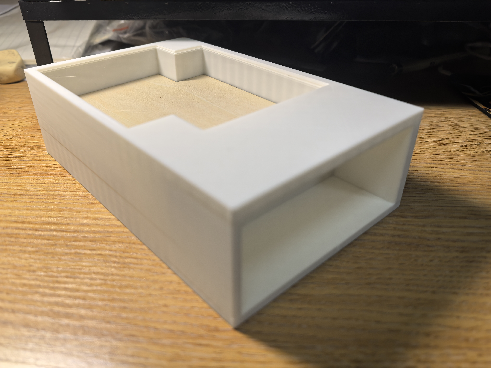
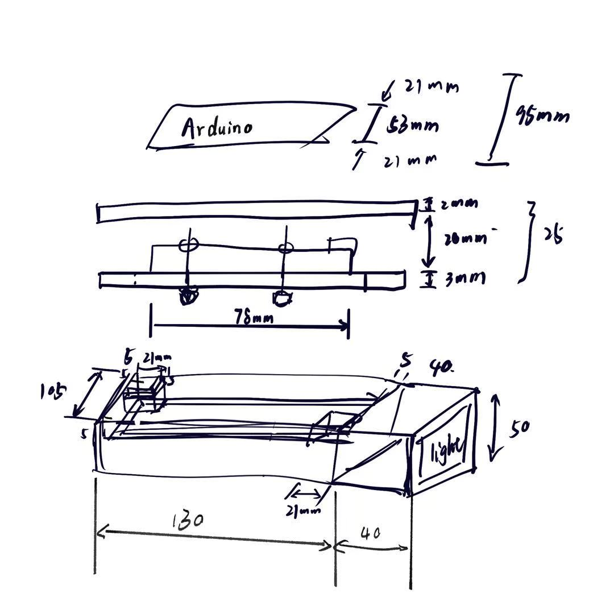
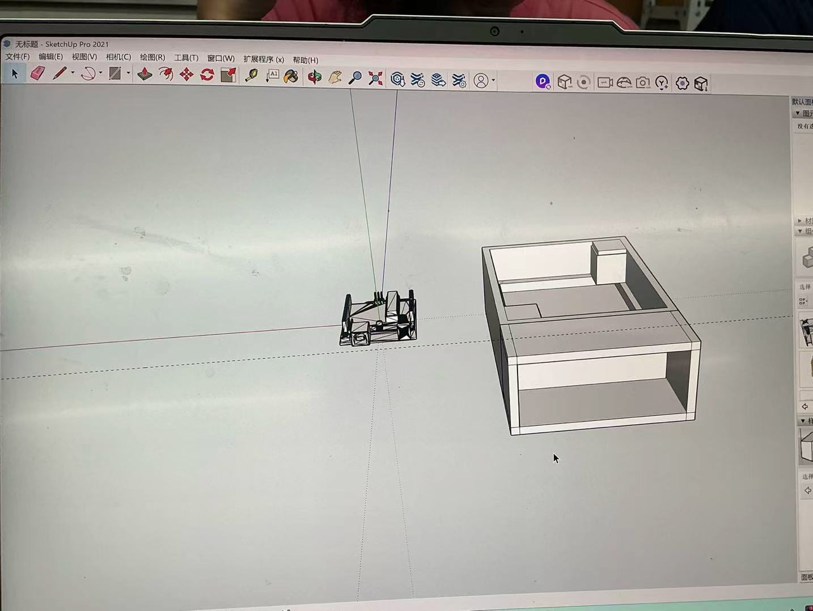
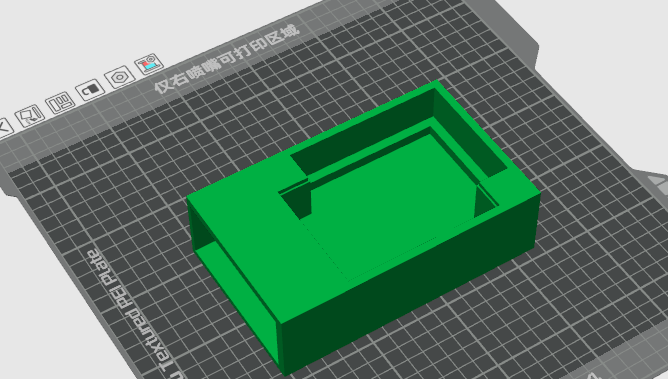
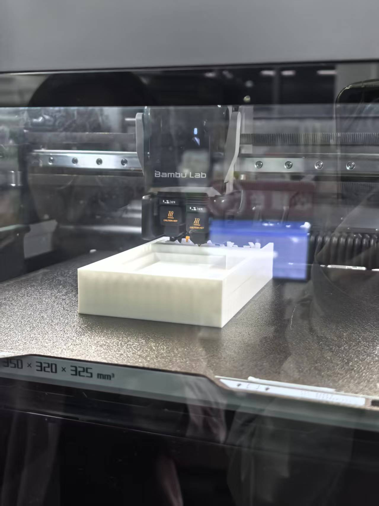
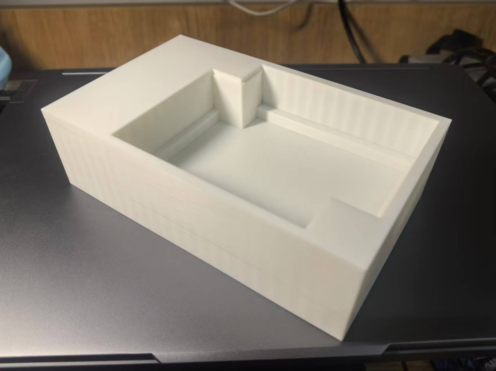
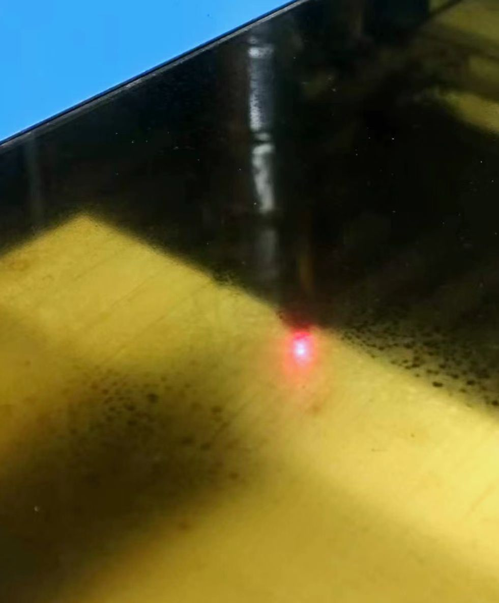

# Output
## Product Background
A century later, the world has achieved the goal of carbon neutrality, and the global climate has entered a phase of stable development. The realization of this achievement is supported by the Global Fundamental Law on Civilization Survival and Ecological Symbiosis as the core legal framework, which also defines two rigid constraints for ecological red lines: first, the global atmospheric carbon dioxide concentration is permanently controlled below 450 ppm; second, the biodiversity conservation volume of each country is incorporated into the civilization survival assessment system, and no development activity is allowed to exceed the "ecological carrying capacity threshold".

## Product Description
Against this backdrop, the portable carbon-based material converter has become a key implementation tool. Developed based on nanocatalysis technology, it is as portable in appearance as a small flashlight. When in use, users only need to point it at industrial waste gas outlets or plastic waste; its built-in micro laser scanner will quickly identify the composition of the substances. Subsequently, through the synergistic effect of high-intensity ultraviolet rays and special catalysts, the device decomposes carbon dioxide in waste gas or plastic waste and re-synthesizes them into high-value biological materials such as degradable plastic particles and biofuel additives. Each use of the device can handle approximately 100 grams of waste, making it easy for environmental law enforcement personnel and enterprise inspection personnel to carry and use at any time, providing strong support for the effective implementation of the legal responsibility for resource recycling.

## The End Product

	

## Source file
[laser cutting source file](https://github.com/lll121383601/How-things-are-made/blob/main/3D%20printing%20and%20laser%20cutting/cutting%20drawing.dwg)

[3D model source file] (https://github.com/lll121383601/How-things-are-made/blob/main/3D%20printing%20and%20laser%20cutting/flashlight.stl)

## Manufacturing process
To create something using 3D printing and laser cutting, you first need an idea💡, and then turn it into a design plan with specific data—like this one.

	

Next, based on your design plan, distinguish the parts suitable for 3D printing from those for laser cutting.
You can draw laser cutting diagrams in your preferred software too, but it must support exporting DXF files. I use AutoCAD.

	

Similarly, for 3D modeling, you can use any modeling software you like and are good at, as long as it supports exporting STL files. I use SketchUp. If you want my source files, just click the link above to download.

	

After that, import the adjusted 3D model file into UltiMaker Cura. Then you can click the button marked by the red box to adjust the infill density.

Once you’re satisfied with the density, click "Start".
PS:My model in this image is larger than the 3D printer matched by the software. Do not imitate.I later switched to a 3D printer, and this is what it looks like before printing.

	

 
Then you can wait beside the 3D printer for it to finish. This way, you can spot any issues promptly if they arise.

	

 

Ta-da! This is my super-simplified flashlight!

	

  

Next, we’ll laser cut a wooden board (for the Arduino mounting plate) and an acrylic board (for the Arduino protection plate). 
First, press the computer’s power button to turn it on. Then open the USB drive, drag the drawn DXF file to the desktop. Right-click the file and select to open it with the Lasercut software (the icon marked by the red circle).
 
PS: If you don’t see the image initially, just left-click once with the mouse—it usually appears then.
 
Then press the key to select all parts of the image. Click the red square below to standardize all parts (since both my boards need cutting). Double-click the editing area on the right to modify the corresponding parameters. For cutting 2mm wood on my machine, the parameters are max power 98, min power 95, and speed 20. After modifying, select all parts of the image, left-click "Tools", then click "Merge Adjacent Lines", "Delete Duplicate Lines" and "Optimize Cutting Path". Then select all parts of the image and click "Load". When your file appears on the cutter’s interface, the laser cutter has "received your command".
 
Next, press "Start" and wait quietly for it to finish.

	

The final step is to assemble all the cut parts together.

	

