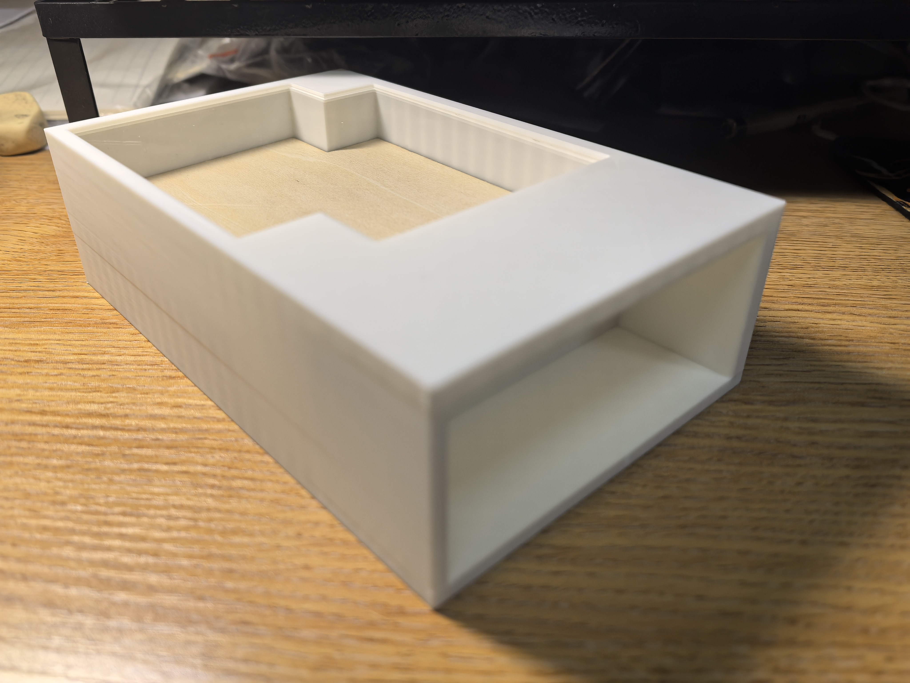

# Output
## Product Background
A century later, the world has achieved the goal of carbon neutrality, and the global climate has entered a phase of stable development. The realization of this achievement is supported by the Global Fundamental Law on Civilization Survival and Ecological Symbiosis as the core legal framework, which also defines two rigid constraints for ecological red lines: first, the global atmospheric carbon dioxide concentration is permanently controlled below 450 ppm; second, the biodiversity conservation volume of each country is incorporated into the civilization survival assessment system, and no development activity is allowed to exceed the "ecological carrying capacity threshold".

## Product Description
Against this backdrop, the portable carbon-based material converter has become a key implementation tool. Developed based on nanocatalysis technology, it is as portable in appearance as a small flashlight. When in use, users only need to point it at industrial waste gas outlets or plastic waste; its built-in micro laser scanner will quickly identify the composition of the substances. Subsequently, through the synergistic effect of high-intensity ultraviolet rays and special catalysts, the device decomposes carbon dioxide in waste gas or plastic waste and re-synthesizes them into high-value biological materials such as degradable plastic particles and biofuel additives. Each use of the device can handle approximately 100 grams of waste, making it easy for environmental law enforcement personnel and enterprise inspection personnel to carry and use at any time, providing strong support for the effective implementation of the legal responsibility for resource recycling.

## The End Product

	

## source file

	

[laser cutting source file](https://github.com/lll121383601/How-things-are-made/blob/main/3D%20printing%20and%20laser%20cutting/cutting%20drawing.dwg)

[3D model source file] (https://github.com/lll121383601/How-things-are-made/blob/main/3D%20printing%20and%20laser%20cutting/flashlight.stl)
