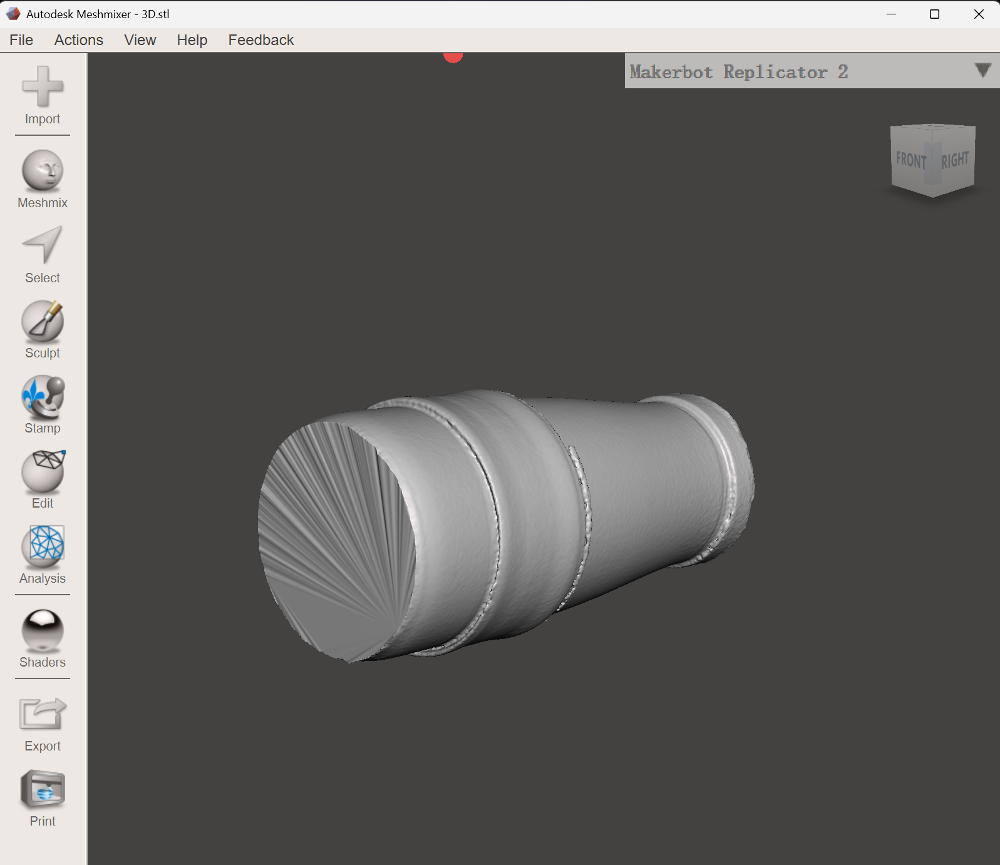
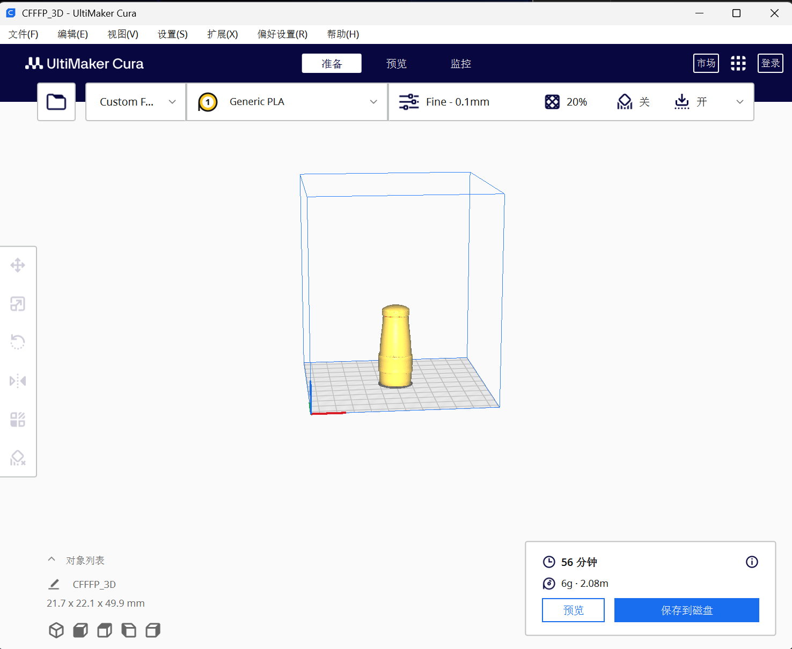
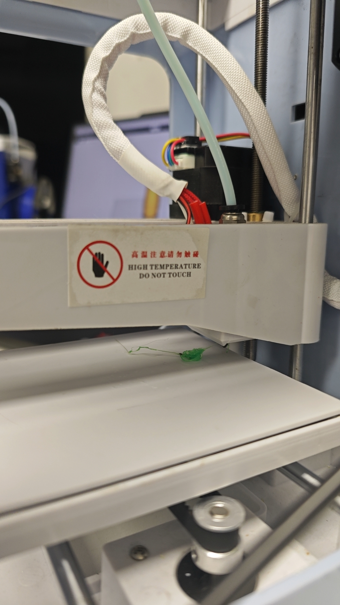
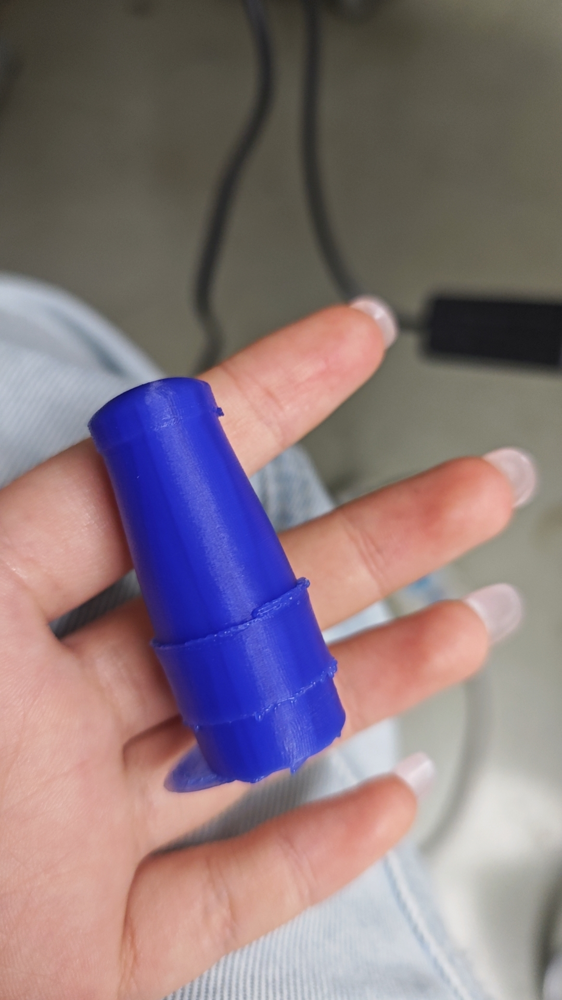
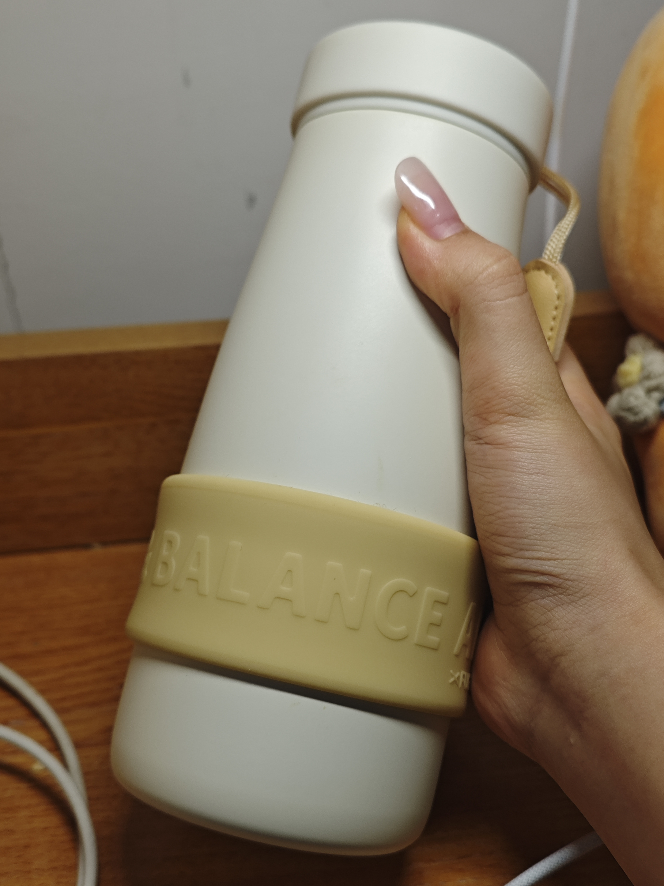

# 3D printing
## Description

The second week's task was to 3D print the model scanned last week.
## Documentation 

First, we use Autodesk meshmixer to process the 3D model obtained from the previous scan.

	

The obtained 3d model file is then imported into the 3D printer.

	

In general, press the start button and wait quietly for the printer to complete.
However...

## Problem 

In the process of using the printer, we encountered a problem: the printing material could not be well adhered to the base plate,  resulting in the melted and solidified Plastic filament following the movement of the hot end, and finally the printing could not continue.

	

By asking the teacher, we learned that it was because the distance between the nozzle and the base plate was too far. 
After adjusting the height of the nozzle, the printing process went smoothly.

	

After about an hour of printing, we successfully got a model of the thermos bottle reduced to a quarter.On the right is a comparison of the original thermos bottle size and hand size.

	
  

