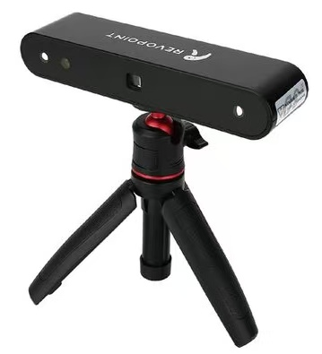
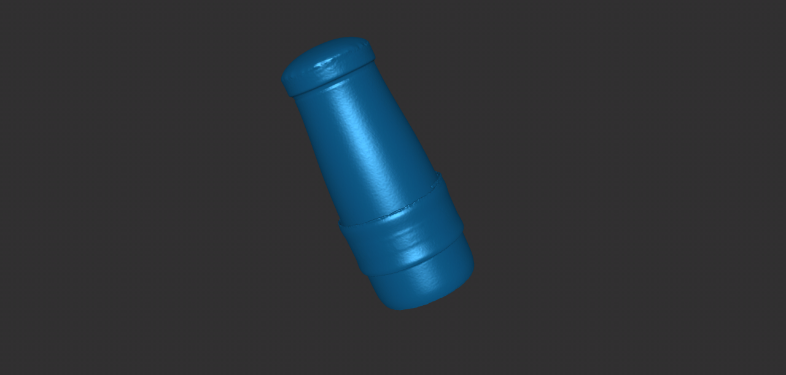

# 3D scanning

## Description
The first task is to do a 3D scan. You can use your own device, to experiment with photogrammetry using mobile apps like "RealityScan" or "3DScanner App". Or try to use the Revopoint pop2, an infrared-depth-map handheld scanner.
If your smartphone or tablet supports photogrammetric scanning apps and has stable internet connectivity, you can try "RealityScan" or "3D Scanner App". And remember to take multiple photos from all angles of your target object. Owing to my class experience with Revopoint Pop2 and the unstable network conditions while scanning objects, I used Revopoint paired with a dual-axis turntable to scan a bottle in 3D.

PS: If you're using Revopoint like I am, be sure to download the Revo Scan app on your phone in advance.
## Documentation 

First, take the 3D scanner and dual-axis turntable out of the box and assemble it as shown below.

	
	

Then, open Revo scan and connect the phone to Revopoint pop2 with a two-in-one data cable. After seeing the point cloud data on the home page of the app, the connection is successful.
Then find the matching dual-axis turntable in the accessory connection, and set the required turntable mode in the dual-axis turntable-advanced mode interface.The advanced mode I set up looks like this.

	

Finally, point Revopoint pop2 at the object, click the dot on the right side of the home page to start scanning, and start the dual-axis turntable. The scanning will end after the turntable has rotated for at least one circle.

## Trial experience
Initially, we attempted to scan the rope-equipped thermos bottle below. However, after multiple attempts, the images obtained all showed the same pattern: the actual rope was never fully captured as a single structure.

	
	

PS:This may be because the bottle or rope was not stationary relative to the rotating platform during rotation, resulting in unreliable scanning. 

So we took the rope off and did a new scan and model, and finally we got a successful scan.
## Output
Here is a display of my scanning results (the STL file is in the 3D Scanning folder):

	

[bottle。stl](https://github.com/lll121383601/How-things-are-made/blob/main/3D%20scanning/bottle_20250921_162110_mesh.stl)
