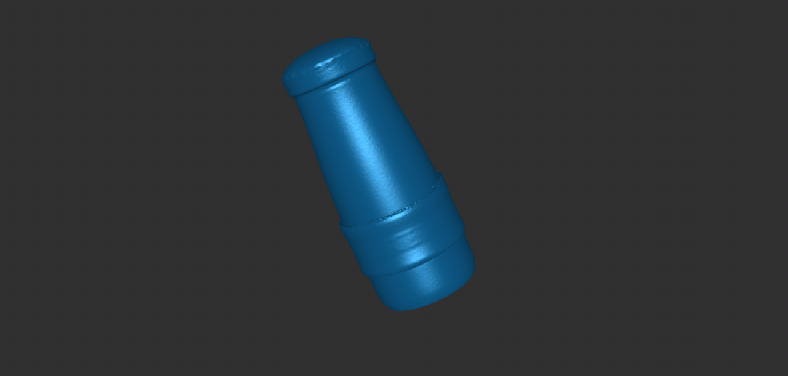
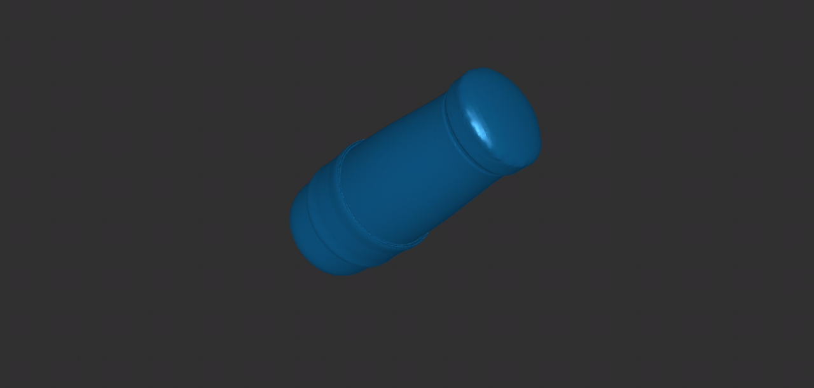
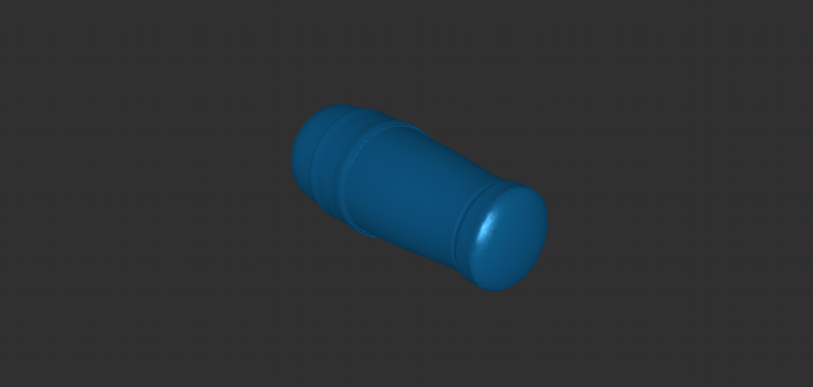

# laser cutting

## Description
The task for this week is to design a kerf test piece.

## Documentation 
First, we measured the wood board with a vernier caliper and found that its thickness was about 2.74mm.

	

Then, we used Adobe Illustrator to make the preliminary design of the kerf testing piece, with a scale range of 2.62mm to 2.84mm, and controlled the adjacent test port scale change to 0.02mm.

	

The wood board was cut by laser cutting machine to obtain the kerf testing piece, but in the end we found that the minimum size was still larger than the thickness of the board. 

	
  
  

## Output
We therefore redesigned the kerf testing piece, with a size range of 2.15 mm to 2.70 mm and a scale of 0.05 mm. This time we found that the size of 2.40 mm was just right for the board.
Here is our output.

	

